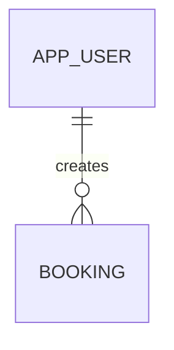
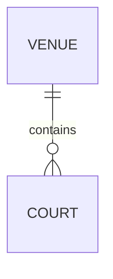
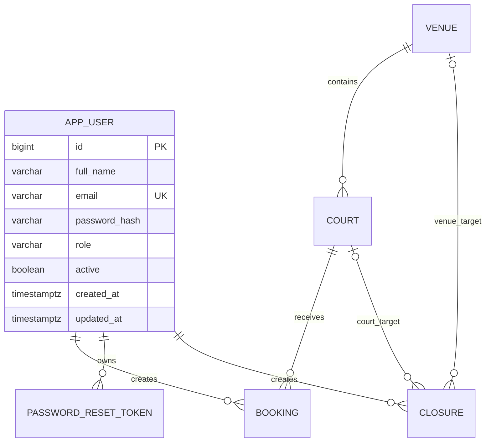

## 怎么查看图？

在 VS Code 打开 `entity diagram.md`，然后按：

```text
Ctrl + Shift + V
```

这会打开 Markdown Preview。

如果 VS Code 本身没有显示 Mermaid，可以安装支持 Mermaid 的 Markdown Preview extension；即使暂时不显示，GitHub 通常也可以渲染 Mermaid。

## 图里的符号是什么意思？

### `||`

表示“必须有一个”。

```text
|| = exactly one
```

### `o{`

表示“可以没有，也可以有很多个”。

```text
o{ = zero or many
```

所以：



表示：

> 一个 Booking 必须属于一个 AppUser；一个 AppUser 可以还没有 Booking，也可以拥有多个 Booking。

### Venue 和 Court


表示：

> 一个 Court 必须属于一个 Venue；一个 Venue 至少有一个 Court，也可以有多个 Court。

不过从实际开发角度，新建 Venue 时可能还没有 Court。因此我更建议把它调整成：



也就是：

> Venue 可以暂时没有 Court，也可以拥有多个 Court。

最终建议使用这个版本：

